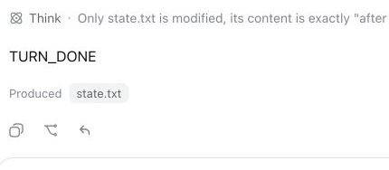
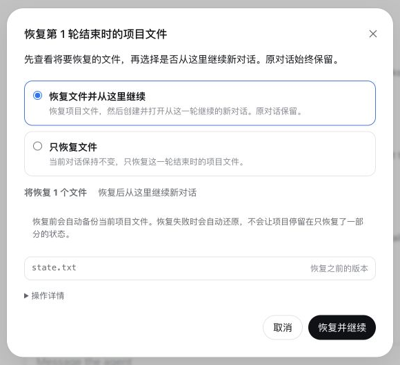

# DSH Turn Rewind

[English](README.md)

为 DeepSeek Harness 提供 Turn 级项目文件恢复，并可选择从恢复后的这一轮继续新对话。

**Turn Rewind** 是用户看到的功能名、仓库名和 Profile Bundle 名。**Change Ledger** 是底层持久恢复引擎；`ctx.changeLedger` 服务、`change_ledger_*` 工具、磁盘格式和存储路径继续保留这个名字，因为它们描述的是可复用的快照与恢复层，而不只是 Web 上的回退按钮。

它给 DSH Session 增加一条明确的安全边界：

```text
创建恢复点
    ↓
Agent / 用户 / 外部程序修改工作树
    ↓
检查逐路径变化
    ↓
规划全部或部分恢复
    ↓
回填短期确认码 + 通过 DSH 人工批准
    ↓
先建救援点 → 恢复 → 哈希验证
```

插件**不会**自动 commit、stash、reset、切分支、修改 Git index，也不会替用户判断某项改动“应该回滚”。

## 效果预览

回退入口是 DSH 原生 Copy、Branch 之后的第三个纯图标：



打开后会先展示受影响文件，可选择“恢复文件并从这里继续”或“只恢复文件”：



## 为什么底层需要 Change Ledger

普通 Git 面板可以展示当前 diff，但不拥有完整、持久的恢复生命周期。Change Ledger 独立负责：

- 内容寻址的恢复点 manifest；
- Git worktree、HEAD、分支和进行中 Git 操作的状态围栏；
- 从审阅到执行之间的 stale plan 检测；
- 短期确认码与 DSH 人工批准双门槛；
- 每次恢复前自动建立救援点；
- 恢复后的内容哈希验证；
- 恢复失败后的自动回滚；
- DSH 重启时对未完成操作日志进行对账；
- 可供其他插件依赖的 `ctx.changeLedger` 公共服务。

持久格式见 [docs/FORMAT.md](docs/FORMAT.md)，安全与故障模型见 [SECURITY.md](SECURITY.md)。

## 安全契约

- **只做显式操作：**工具说明要求模型仅在用户明确提出时创建恢复点。
- **先读后写：**`change_ledger_plan_restore` 只生成短期计划和确认码，不修改文件。
- **人工门禁：**`change_ledger_apply_restore` 与 `change_ledger_delete` 在执行前固定返回 DSH `ask`；无人值守的 `approval: never` 配置会 fail closed。
- **先救援再修改：**恢复任何文件前，先持久化当前 eligible tree 的救援点。
- **不静默漏文件：**遇到 submodule、sparse checkout、超限文件、总量超限或特殊文件类型时，创建恢复点直接失败。
- **不允许路径逃逸：**所有持久路径必须是规范的工作树相对路径；恢复拒绝穿过 symlink 父目录，也拒绝覆盖非空目录。
- **不覆盖审阅后的新变化：**执行时重新检查所选路径，以及审阅过的 HEAD、分支和 Git 操作状态；任何相关变化都会使计划失效。
- **不碰 Git 控制面：**index、分支、HEAD、stash 和 commit 均保持原样。

## 支持范围

`0.1` 只支持普通 Git worktree：

- tracked 文件，包括恢复点创建时已经缺失的 tracked 路径；
- 未被 `.gitignore` 或 Git 标准 excludes 忽略的 untracked 文件；
- 文本和二进制普通文件；
- 符号链接；
- 可执行位等可移植权限位。

下列对象会被拒绝或明确排除：

- sparse checkout；
- submodule gitlink（应分别进入每个 submodule 建恢复点）；
- ignored 文件；
- socket、设备、FIFO 等特殊文件；
- 扩展属性、ACL、所有者、时间戳和 hard-link 拓扑；
- Git index 和仓库元数据；
- 非 Git 目录。

如果 ignored 或其他未受管理的文件占据了待恢复路径，插件会拒绝恢复，不会递归删除它。

## 安装

```sh
pnpm install --frozen-lockfile
pnpm run check

dsh plugin --profile web add /path/to/dsh-turn-rewind
dsh plugin --profile headless add /path/to/dsh-turn-rewind

dsh --profile web --dump-config | grep turn-rewind
```

修改 Profile Bundle 后需要重启对应 DSH 进程。

本仓库是标准 DSH Profile Bundle：`package.json` 声明 `dsh.bundle.patch`，`cordis.patch.yml` 直接挂载 `@dsh-external/turn-rewind`，不修改 DSH 主仓库。

当 Profile 同时提供 DSH Agent 服务时，插件会在每个已完成 Turn 后同步占用 Agent 的 idle maintenance 边界，先保存隐藏的文件状态，再允许排队输入启动下一轮。插件不会为其开始观察 Turn 边界之前恢复的历史记录伪造文件状态，因为当前项目文件可能早已不再代表过去那一轮。Web Profile 还会提供同源 `/turn-rewind` 接口：分页返回文件预览，生成短期、会话绑定的恢复授权，并把“从这里继续”的子 Session 创建委托给 DSH 官方 Host fork 生命周期。Turn 完成只会保存状态，绝不会自动恢复文件。

## 使用流程

在 Web Profile 中，每个已落定的 Assistant Turn 都会在原生 Copy、Branch 操作之后的第三位显示一个紧凑、无文字的**回退**图标。图标使用明确的向后/撤销箭头，而不是“重试”圆形箭头。打开后按需检查保存的文件状态，先显示简洁预览，需要时可“查看全部文件”，并提供两种模式：

| 模式 | 代码 | 对话 |
| --- | --- | --- |
| **恢复文件并从这里继续**（默认） | 自动备份当前状态后恢复项目文件。 | 创建并自动打开截至所选 Turn 的子 Session。 |
| **只恢复文件** | 自动备份当前状态后恢复项目文件。 | 当前 Session 保持原位且内容不变。 |

弹窗和最终主按钮就是确认流程，不再要求重复勾选。文件会按实际结果显示为“恢复之前的版本”“找回文件”“移除后来新增的文件”“恢复文件权限”或“恢复之前的文件类型”。底层文件状态、恢复授权和自动备份标识默认收进折叠的“操作详情”。如果项目文件已经与所选 Turn 一致，Turn Rewind 不会退化为 Branch，而是提示无需恢复并引导用户使用原生 **Branch**。

真正修改前，Turn Rewind 会再次检查所选文件和项目版本状态，并先创建自动备份。预览后出现的新变化会让本次恢复失效。同一工作树如果还有其他 Session 正在运行，恢复会被阻止，因为文件变化也会影响那些对话；仅处于空闲状态的 Session 不会阻止恢复。如果“恢复并继续”在创建新对话时失败，Change Ledger 会自动从备份恢复操作前的文件。

DSH Session 日志是 append-only，因此“从这里继续”的底层实现是：让官方 Host API 从精确的已完成 Turn 边界创建子 Session，再自动打开该子 Session。Fork 子 Session 只有在目标边界位于每一层持久化 `seedLength` 围栏内、并仍与祖先的精确 `turn/end` 一致时，才能复用祖先文件状态；子 Session 自己的状态优先，兄弟分支之间不会混用。**Branch** 只创建对话分支且保持项目文件不变；**Turn Rewind** 一定恢复项目文件，并可选择是否随后创建对话分支。原 Session 始终保留。

可以直接向 Agent 提出：

```text
创建一个名为“重构鉴权前”的 Change Ledger 恢复点。

检查恢复点 rp_...，展示前 100 条变化。

规划只恢复 rp_... 中的 src/auth.ts 和 tests/auth.test.ts。

使用确认码 RESTORE-... 执行 plan_...。
```

最后一步仍会弹出 DSH 标准人工批准框。拿到计划确认码不等于绕过批准。

## 工具

| 工具 | 是否修改 | 用途 |
| --- | --- | --- |
| `change_ledger_create` | 只写状态目录 | 创建用户恢复点。 |
| `change_ledger_list` | 否 | 分页列出恢复点；默认隐藏自动救援点。 |
| `change_ledger_inspect` | 否 | 分页查看当前工作树相对恢复点的变化。 |
| `change_ledger_plan_restore` | 只写内存计划 | 选择精确路径并生成短期确认码。 |
| `change_ledger_apply_restore` | 工作树 | 经批准后建立救援点、恢复并验证。 |
| `change_ledger_delete` | 状态目录 | 经批准后删除恢复点并回收无引用 blob。 |
| `change_ledger_recovery_list` | 否 | 分页查看中断操作及其救援点。 |

模型可见的列表、检查、故障恢复、计划和执行结果均有分页或截断上限；同进程服务 API 会向可信插件返回完整结构化数据。

## 配置

在 Profile 的 patch 层覆盖：

```yaml
- id: turn-rewind
  config:
    storageDir: ~/.dsh/change-ledger/v1
    maxRestorePoints: 50
    maxTurnCheckpointsPerSession: 30
    maxFiles: 20000
    maxFileBytes: 16777216
    maxSnapshotBytes: 536870912
    planTtlMs: 900000
    staleLockMs: 30000
```

所有容量与用户恢复点数量限制都采用 fail loud。自动 Turn 检查点使用独立的每会话保留窗口，并且只清理自己最旧的检查点；用户和救援恢复点永远不会被静默删除。未配置时，`storageDir` 使用 `$DSH_HOME/change-ledger/v1`，未设置 `DSH_HOME` 时回退到 `~/.dsh/change-ledger/v1`；它不得与被管理 worktree 重叠。

## 故障恢复

任何路径写入前，插件都会先创建救援点和持久 operation journal。如果 DSH 在非终态操作期间退出，下次启动会把该操作标记为 `interrupted`；如果另一个仍存活的 DSH 进程持有工作树锁，则不会误判其操作。

使用 `change_ledger_recovery_list` 找到 `rescuePointId`，检查该救援点，然后针对 operation 中的路径走正常的 plan/apply 流程。救援点在被显式删除前始终是普通、可检查的恢复点。

## 公共服务

其他 Cordis 插件可以注入 `changeLedger`，直接调用结构化 API：

```ts
export const inject = ['changeLedger']

export async function apply(ctx: Context) {
  const point = await ctx.changeLedger.create({
    cwd: '/absolute/git/worktree',
    sessionId: 'session-id',
    label: 'before refactor',
  })
  // point.id 是持久恢复点 ID。
}
```

完整格式类型从 `@dsh-external/turn-rewind/format` 导出；可信集成和测试可以从 `@dsh-external/turn-rewind/core` 使用独立 Engine。

## 开发

```sh
pnpm install --frozen-lockfile
pnpm run check
```

测试会创建真实的临时 Git 仓库，覆盖全部/部分恢复、stale plan、ignored 路径冲突拒绝、HEAD 变化、救援回滚、崩溃对账、活动锁保护、持久状态完整性、symlink、容量限制、sparse checkout、submodule、删除和 blob GC。

## 许可证

BSD-3-Clause，见 [LICENSE](LICENSE)。
